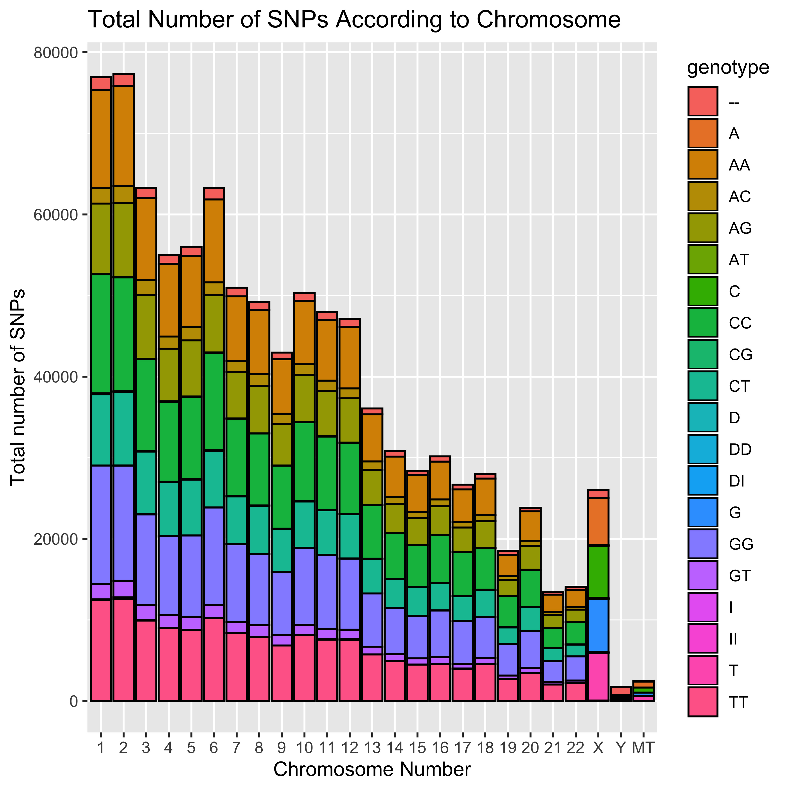

```{r setup, include=FALSE}
knitr::opts_chunk$set(echo = TRUE)
```


```{r, message=FALSE}
library(tidyverse)
library(ggplot2)
library(RColorBrewer)
library(plotly)
library(DT)
```

```{r}
SNPs <- read.table("23andMe_complete.txt", header = T, sep = "\t")
```


```{r}
##Exercise No. 1
SNPs$chromosome = ordered(SNPs$chromosome, levels=c(seq(1, 22), "X", "Y", "MT"))
ggplot(SNPs, aes(chromosome)) + geom_bar(colour="blue") + ggtitle("Total number of SNPs per Genotype") + ylab("Total number of SNPs") + xlab("Chromosome")
```

```{r}
##Exercise No. 2

##I colored all dinucleotides one color, all mononucleotides a color, and then all "D" the same and "I" the same. This produced the following graph. Although it overwhelmingly looks purple, I believe I designated colors correctly and this is due to the data. Did I do this correctly?

RoyGeeBiv <- c("AA"="#660099","A"="#0099CC","AC"="#660099","AG"="#660099","AT"="#660099","C"="#0099CC","CC"="#660099","CG"="#660099","CT"="#660099","D"="#FF9933","DD"="#FF9933","DI"="#FF9933","G"="#0099CC","GG"="#660099","GT"="#660099","I"="#330033","II"="#330033","T"="#0099CC","TT"="#660099","--"="#000033")
ggplot(SNPs, aes(chromosome, fill=genotype)) + geom_bar(color="black") + 
  ggtitle("Total Number of SNPs According to Chromosome") + 
  ylab("Total number of SNPs") + 
  xlab("Chromosome Number") +
  scale_fill_manual(values = RoyGeeBiv)
```

```{r}
##Exercise No. 3
ppi <- 600
png("SNPGenotype_plot.png", width=6*ppi, height=6*ppi, res=ppi)

ggplot(SNPs, aes(chromosome, fill=genotype)) + geom_bar(color="black") + 
  ggtitle("Total Number of SNPs According to Chromosome") + 
  ylab("Total number of SNPs") + 
  xlab("Chromosome Number")
dev.off()
```

 

```{r, fig.width=15, fig.height=15}
#Exercise No. 4
##I am having trouble expanding the x-axis so that all genotype designations are visible, although I was able to change the y-axis size.

ggplot(SNPs, aes(chromosome, fill=genotype)) + geom_bar(position="dodge") + facet_wrap(~chromosome) +
  scale_fill_manual(values = RoyGeeBiv, name="Genotype") +
    facet_wrap(~ genotype, nrow = 4) +
  ggtitle("Total Number of SNPs According to Chromosome") + 
      ylab("Total number of SNPs") + 
      xlab("Chromosome Number")
```

```{r}
##Exercise No. 5
p <- ggplot(SNPs, aes(chromosome, fill=genotype)) + geom_bar(position="dodge") + facet_wrap(~chromosome) +
  scale_fill_manual(values = RoyGeeBiv, name="Genotype") +
    facet_wrap(~ genotype, nrow = 4) +
  ggtitle("Total Number of SNPs According to Chromosome") + 
      ylab("Total number of SNPs") + 
      xlab("Chromosome Number")
ggplotly(p)
```

```{r}
##Exercise No. 6
Y_Chrom <- filter(SNPs, chromosome == "Y")
datatable(Y_Chrom)
```